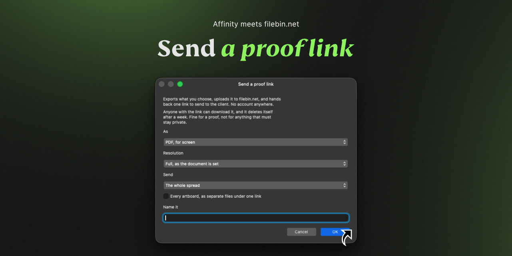

# Send a proof link for Connector for Affinity

Export artwork from Affinity, upload it to [filebin.net](https://filebin.net), and get one link ready to send to a client. No account or API key is needed.

## What you need

- **Connector for Affinity** installed and connected to Affinity.
- An open document, selection, artboard, layer, or file to send.

Anyone who has the resulting link can download its files. filebin.net deletes the upload after about a week, so use it for reviews and proofs — not for anything that must remain private or available long-term.

## Install from the Marketplace

1. Open **Connector for Affinity**.
2. Choose **Browse** in the sidebar.
3. Search for **Send a proof link**.
4. Select it and press **Install**.
5. Open it from the Connectors list, or add it to the Floating Bar.

There is no account setup. When you later choose **Update** in the Marketplace, your saved connector preferences stay in place.

## Use it in Affinity

1. Choose the export format: print-ready PDF, screen PDF, PNG, or JPEG.
2. Under **Send**, choose what should go in the proof — the spread, a page, selection, artboard, layer, document, or file.
3. Optionally turn on **Every artboard** to put one exported file per artboard under the same link.
4. Give the proof a clear name, or leave it empty to use the document name and date.
5. Press **Upload and get a link**.

The completed run shows a copyable link and its expiry date. Send that link to the client; they do not need Connector for Affinity or a filebin account.

## Controls

| Control | What it changes |
| --- | --- |
| **As** | Chooses PDF, PNG, or JPEG export. |
| **Resolution** | For PNG and JPEG only, optionally downsamples a copy for review or screen use. It never enlarges artwork. |
| **Send** | Chooses the artwork or file to upload. |
| **Every artboard, as separate files under one link** | Exports every artboard separately while giving all files the same proof link. |
| **Name it** | Becomes the readable part of the link. The connector adds the date and a short unique suffix. |

## Notes

- One upload can contain several files, but all of them are public to anyone who knows the link.
- The service normally retains a bin for seven days. The exact deletion date is included in the returned message when filebin.net reports it.
- The link is generated before the upload begins, so Connector for Affinity can report exactly which file failed if filebin.net rejects one.

## Development

This connector consists of [`app.json`](app.json), which describes the form, and [`index.js`](index.js), which exports artwork and uploads it to filebin.net. Install it from the Marketplace for normal use; the files here are for review and development.
